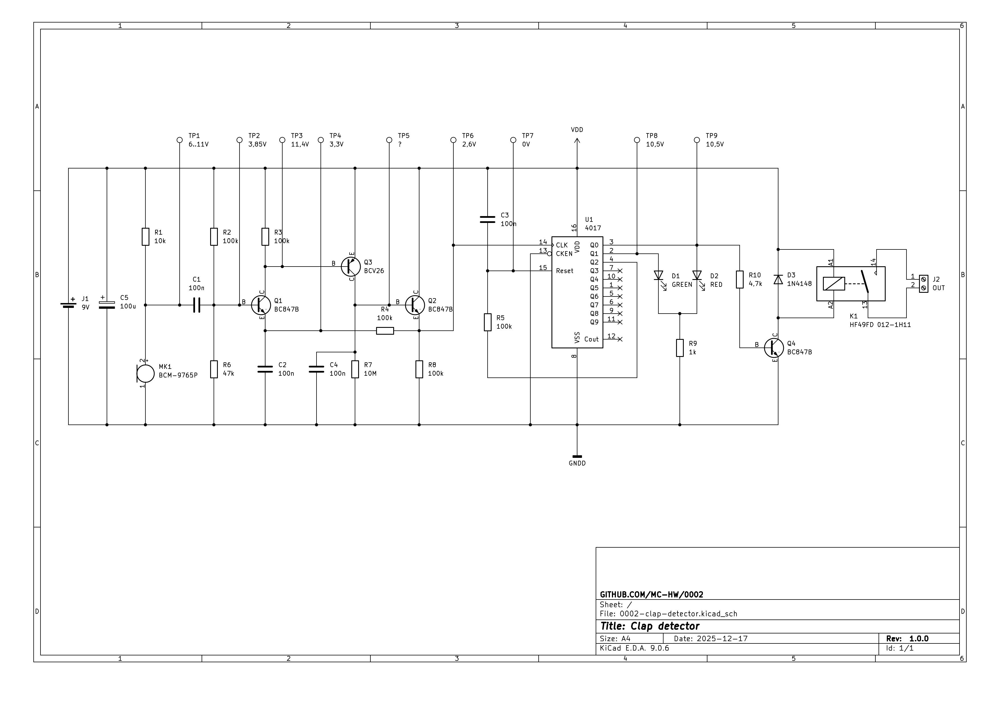
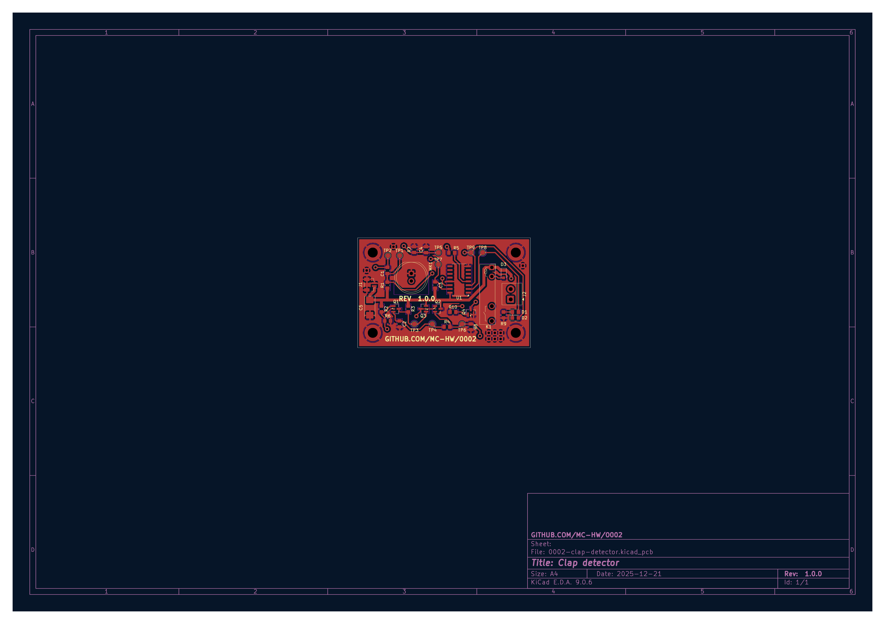
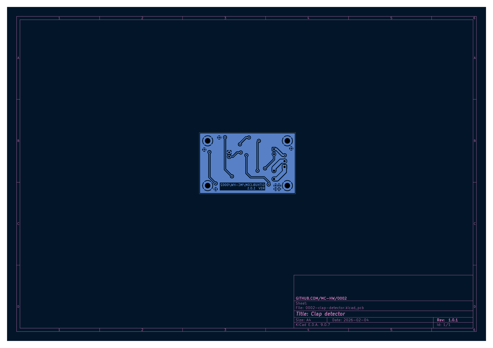

# Clap detector (0002)

Clap-detecting switch

## Description

This circuit is a copy of [AVT-721/2](./AVT721_2.pdf) converted to Surface Mounted Technology.

## Assembly

The circuit should be assembled on a double-sided, SMT printed circuit board.

## Running

The device should be powered with 6-10DCV. It was intended to be powered from 6F22 9V battery connected to J1 connector.
The circuit after detecting a clap, switches D1 diode on and off. Additionally, it enables/disables K1 relay. A device
of max 230V/1000W can be enabled/disabled using J2 connector.

## Bill of materials

| Reference      | Qty | Value           | Package           |
|----------------|-----|-----------------|-------------------|
| C1,C2,C3,C4    | 4   | 100n            | 0805              |
| C5             | 1   | 100u            | 2312              |
| D1             | 1   | GREEN           | 0805              |
| D2             | 1   | RED             | 0805              |
| D3             | 1   | 1N4148          | SOD-323           |
| J1             | 1   | 9V              | JST-SH 1x2 PIN    |
| J2             | 1   | OUT             | ARK 3,5mm 1x2 PIN |
| K1             | 1   | HF49FD 012-1H11 |                   |
| MK1            | 1   | BCM-9765P       |                   |
| Q1,Q2,Q4       | 3   | BC847B          | SOT-23            |
| Q3             | 1   | BCV26           | SOT-23            |
| R1             | 1   | 10k             | 0805              |
| R2,R3,R4,R5,R8 | 5   | 100k            | 0805              |
| R6             | 1   | 47k             | 0805              |
| R7             | 1   | 10M             | 0805              |
| R9             | 1   | 1k              | 0805              |
| R10            | 1   | 4,7k            | 0805              |
| U1             | 1   | 4017            | SOP-16            |
